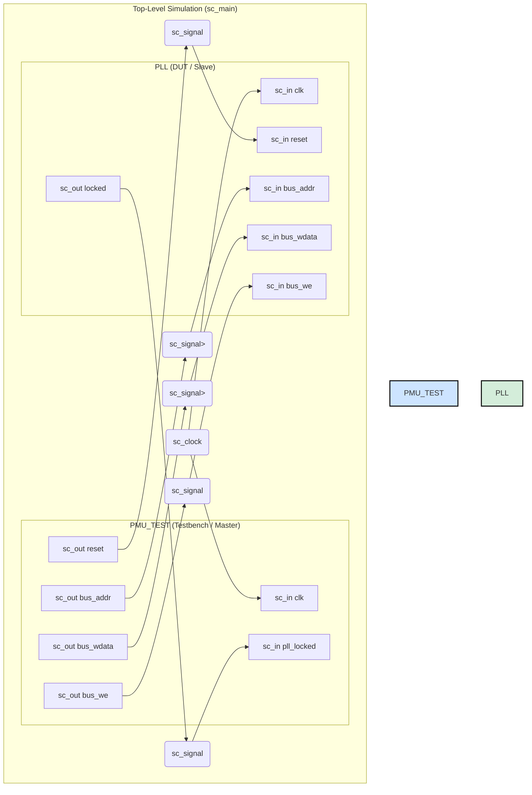
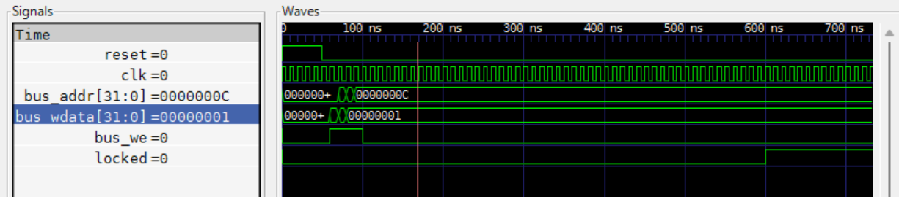

# SystemC PLL Configuration & Verification Environment

**A high-level C++ and SystemC project demonstrating the architectural modeling, verification, and performance analysis of a Power Management Unit (PMU) configuring a Phase-Locked Loop (PLL).**

This project serves as a practical example of the "shift-left" methodology used in the VLSI industry, where system architecture and performance are validated long before RTL implementation begins. It features a complete, self-contained verification environment with a smart testbench, a behavioral DUT, and tangible, verifiable results in the form of console logs and VCD waveforms.

---

## Table of Contents
- [Project Overview](#project-overview)
- [Key Features](#key-features)
- [Architectural Block Diagram](#architectural-block-diagram)
- [Working Flow](#working-flow)
- [Tools and Technology Stack](#tools-and-technology-stack)
- [Verification and Results](#verification-and-results)
- [Setup and Execution](#setup-and-execution)

## Project Overview
The goal of this project is to simulate a realistic SoC scenario: an intelligent Power Management Unit (PMU) testbench that configures a digital PLL model. The testbench is responsible for calculating the correct divider values for a target frequency, programming the PLL's registers over a simple bus protocol, and then verifying that the PLL achieves a frequency lock within a specified time. This entire environment is built from scratch to demonstrate a full-cycle verification workflow.

## Key Features
- **Behavioral Modeling:** The PLL is modeled as a digital block with configuration registers and status outputs, abstracting away the complex analog internals.
- **Transaction-Level Testbench:** A "smart" testbench acts as a bus master, driving transactions to configure the DUT.
- **Performance Modeling:** The PLL's physical lock-in time is accurately modeled using a `wait(500, SC_NS)` statement, allowing for early performance analysis.
- **Automated Build System:** A cross-platform `Makefile` automates the entire compile, link, and run process.
- **Visual Verification:** The simulation generates a VCD (Value Change Dump) file for detailed, bit-level waveform analysis in GTKWave.

## Architectural Block Diagram

The system consists of two primary modules: the `PMU_TEST` (master) and the `PLL` (slave), connected by a global clock, reset, and a simple communication bus. The PMU drives the configuration, and the PLL provides a `locked` status as feedback. The entire environment is instantiated and connected in `sc_main`.



## Working Flow
1.  **Reset Phase:** The `PMU_TEST` asserts a reset signal for 50ns to initialize the `PLL` to a known state.
2.  **Configuration Phase:** The `PMU_TEST` calculates the required dividers for 800 MHz and performs four single-cycle writes over the bus to program the PLL's registers. This phase completes at the 100ns mark.
3.  **Locking Phase:** The final register write enables the PLL, which begins its 500ns lock sequence.
4.  **Verification:** The `PMU_TEST` monitors the `locked` signal. At the 600ns mark, the PLL asserts the `locked` signal high. The testbench detects this, declares the test a success, and stops the simulation.

## Tools and Technology Stack
- **Languages:** C++ (using the C++17 standard)
- **Core Library:** SystemC 3.0.1
- **Compiler:** G++ (from the MinGW-w64 toolchain)
- **Build System:** GNU Make
- **Waveform Viewer:** GTKWave
- **Development Environment:** VS Code on Windows with MSYS2

## Verification and Results
The correctness of the simulation is verified through two primary artifacts: the console log and the VCD waveform.

### Console Log Analysis
The console log provides a human-readable, time-stamped narrative of the entire simulation run, confirming the test sequence and the final pass/fail status.

```text
Instantiating modules...
PMU Testbench module constructed.
PLL module constructed.
Creating signals and clocks...
Connecting modules...
Starting simulation...
PMU_TEST: Resetting the system...
@50 ns: PLL received write to REG[0] with data 0x0
... (Reset logs omitted for brevity) ...
PMU_TEST: Starting test case: Configure PLL for 800 MHz.
PMU_TEST: Calculation successful. N=1, M=32, OD=1
PMU_TEST: Programming PLL registers...
  PMU_DRIVER: Wrote 0x1 to address 0x0
@70 ns: PLL received write to REG[0] with data 0x1
  PMU_DRIVER: Wrote 0x20 to address 0x4
@80 ns: PLL received write to REG[1] with data 0x20
  PMU_DRIVER: Wrote 0x1 to address 0x8
@90 ns: PLL received write to REG[2] with data 0x1
  PMU_DRIVER: Wrote 0x1 to address 0xc
@100 ns: PLL received write to REG[3] with data 0x1
PMU_TEST: Waiting for PLL lock signal...
@100 ns: PLL enabled. Starting lock sequence.
@100 ns: PLL is in LOCKING state. Waiting for 500 ns.
@600 ns: PLL lock time elapsed.
@600 ns: PLL LOCKED. Generating output clock with period 1.25 ns.
PMU_TEST: ✅ SUCCESS! PLL lock signal asserted.
PMU_TEST: Test finished.
Simulation finished at 850 ns
```


### Waveform Analysis

The `waveform.vcd` file provides irrefutable, bit-level proof of the system's behavior. The waveform below clearly shows the initial reset pulse, the four subsequent bus write transactions, and the critical transition of the `locked` signal from low to high at exactly the 600ns mark, matching the console log and the specification perfectly.



## Setup and Execution

This project was built and tested on Windows 10 using the MSYS2/MinGW-w64 toolchain.

**1. Prerequisites:**
- G++ C++17 compiler (or compatible)
- GNU Make
- A compiled SystemC 3.0.1 library

**2. Configuration:**
- Clone the repository to your local machine.
- Set the `SYSTEMC_HOME` environment variable to point to the root of your SystemC installation. For example, in a Windows Command Prompt:
  ```cmd
  set SYSTEMC_HOME=C:\systemc-3.0.1

**3. Build and Run:**
- Navigate to the root of the project directory in your terminal and use the following commands:
- make clean : Cleans all previous build artifacts (obj and bin directories).
- make : Compiles all C++ source code and links the final executable.
- make run : Executes the simulation, prints the log to the console, and generates waveform.vcd.

© 2025 Kumar Vedang. All Rights Reserved. Unauthorized distribution or reproduction of this project and its contents is strictly prohibited.
